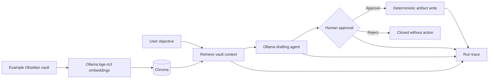

# Personal Agentic System

A private, portfolio-ready version of the patterns behind **MJ-OS**: local-first
memory, Ollama embeddings, Chroma retrieval, MCP tools, and explicit human
approval before an agent can persist an artifact.

This is not a copy of the private MJ-OS workspace. It preserves the architecture
while replacing personal notes, credentials, generated indexes, and live bot
configuration with safe examples.

## What this demonstrates

- An Obsidian-compatible Markdown vault as the source of knowledge
- Local multilingual embeddings through Ollama (`bge-m3` by default)
- Rebuildable Chroma vector storage; generated indexes are never committed
- An MCP server exposing `index_vault`, `memory_search`, `create_draft`, and
  `approve_draft`
- A deterministic approval gate: the model may draft, but only approved code
  writes a final artifact
- JSON run records for traceability, latency, model attribution, and estimated cost
- An optional allowlisted Telegram command gateway without publishing secrets

## System flow



## Quick start

1. Install [Ollama](https://ollama.com/) and pull the configured models:

   ```bash
   ollama pull bge-m3
   ollama pull qwen2.5:7b
   ```

2. Create the environment and install the project:

   ```bash
   python3 -m venv .venv
   source .venv/bin/activate
   pip install -e '.[dev]'
   cp .env.example .env
   ```

3. Index the synthetic example vault and run an approval-gated demo:

   ```bash
   pas index
   pas search "What controls should an AI workflow use?"
   pas draft "Create an AI exception-handling checklist"
   pas approve <run-id> --reviewer "portfolio-demo"
   ```

4. Expose the same capabilities to Claude Code, Codex, or another MCP client:

   ```bash
   pas-mcp
   ```

5. Optionally add your bot token and allowed chat ID to `.env`, then run:

   ```bash
   pas-telegram
   ```

See [docs/architecture.md](docs/architecture.md) for boundaries and design
decisions, and [docs/system-spec.md](docs/system-spec.md) for the reusable spec.

## Safety boundary

The language model is allowed to retrieve and draft. It is not allowed to
authorize or persist a final artifact. Approval validation and file writing are
ordinary deterministic Python operations with an auditable run record.

## Current status

Version `0.1` is the first portfolio vertical slice. Planned extensions include
hybrid BM25 retrieval, richer evaluation fixtures, and an integration guide for
the Hermes operational dashboard.
