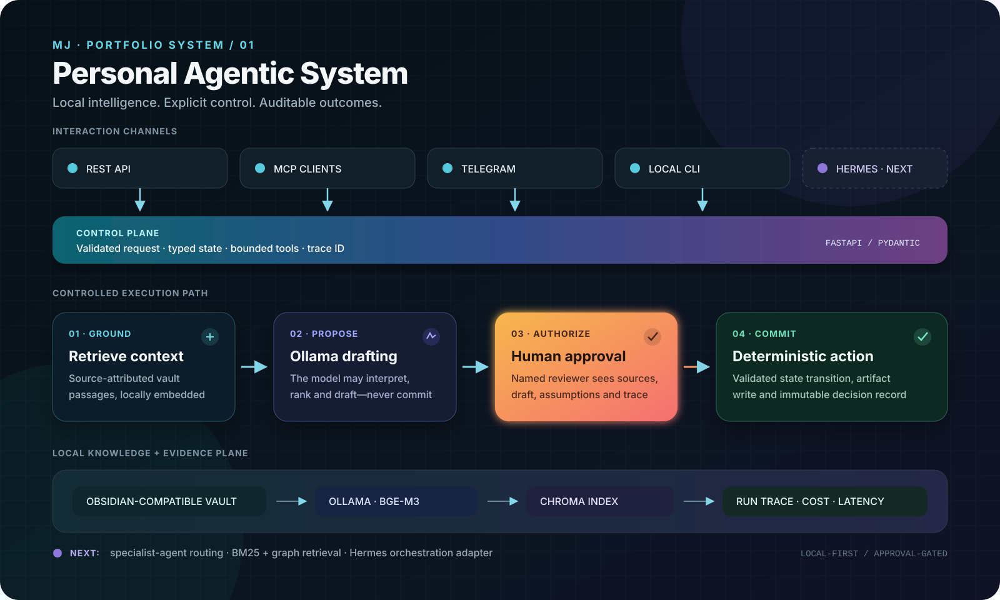

<div align="center">

# Personal Agentic System

**A focused, local-first reference architecture for safe enterprise agent workflows.**

`Ollama` · `Obsidian` · `Chroma` · `MCP` · `FastAPI` · `Human approval`

</div>

A private, portfolio-ready version of the patterns behind **MJ-OS**: local-first
memory, Ollama embeddings, Chroma retrieval, MCP tools, and explicit human
approval before an agent can persist an artifact.

This is not a copy of the private MJ-OS workspace. It preserves the architecture
while replacing personal notes, credentials, generated indexes, and live bot
configuration with safe examples.

## Architecture

<p align="center">
  
</p>

The central design rule is simple: **models may propose; deterministic code and
named humans authorize.** Every final artifact follows a visible state transition
from draft to approval or rejection.

## What this demonstrates

- An Obsidian-compatible Markdown vault as the source of knowledge
- Local multilingual embeddings through Ollama (`bge-m3` by default)
- Rebuildable Chroma vector storage; generated indexes are never committed
- An MCP server exposing `index_vault`, `memory_search`, `create_draft`, and
  `approve_draft`
- A deterministic approval gate: the model may draft, but only approved code
  writes a final artifact
- JSON run records for traceability, latency, model attribution, and estimated cost
- An optional allowlisted Telegram command gateway without publishing secrets
- A typed FastAPI surface for memory, runs, approvals, and operational metrics
- A model gateway that attributes provider, model, tokens, latency, and API cost
- Docker Compose for a repeatable local API + Ollama environment
- GitHub Actions quality checks for every proposed change

## Focused portfolio scenario

A fictional enterprise operations team requests an AI exception-handling
checklist. The system retrieves approved controls, drafts a recommendation,
pauses for a named reviewer, and only then writes—or refuses to write—the final
artifact. The run retains its sources, model attribution, latency, decision, and
reviewer.

## Quick start

1. Install [Ollama](https://ollama.com/) and pull the configured models:

   ```bash
   ollama pull bge-m3
   ollama pull qwen2.5:7b
   ```

2. Create the environment and install the project:

   ```bash
   python3 -m venv .venv
   source .venv/bin/activate
   pip install -e '.[dev]'
   cp .env.example .env
   ```

3. Index the synthetic example vault and run an approval-gated demo:

   ```bash
   pas index
   pas search "What controls should an AI workflow use?"
   pas draft "Create an AI exception-handling checklist"
   pas approve <run-id> --reviewer "portfolio-demo"
   ```

4. Expose the same capabilities to Claude Code, Codex, or another MCP client:

   ```bash
   pas-mcp
   ```

5. Optionally add your bot token and allowed chat ID to `.env`, then run:

   ```bash
   pas-telegram
   ```

6. Run the typed REST API locally:

   ```bash
   pas-api
   # Interactive API documentation: http://localhost:8001/docs
   ```

   Control endpoints require `Authorization: Bearer <API_CONTROL_TOKEN>`.

Or start the API and Ollama together:

```bash
docker compose up -d --build
docker compose exec ollama ollama pull bge-m3
docker compose exec ollama ollama pull qwen2.5:7b
```

See [docs/architecture.md](docs/architecture.md) for boundaries and design
decisions, and [docs/system-spec.md](docs/system-spec.md) for the reusable spec.

## Safety boundary

The language model is allowed to retrieve and draft. It is not allowed to
authorize or persist a final artifact. Approval validation and file writing are
ordinary deterministic Python operations with an auditable run record.

## Current status

Version `0.2` provides the controlled vertical slice plus a typed API, normalized
model attribution, container packaging, and continuous quality checks. The next
increments add specialist-agent routing, hybrid BM25/graph retrieval, and a
Hermes orchestration adapter without creating a second dashboard.

## Usage and copyright

Portfolio review only. No open-source license is granted. See [COPYRIGHT.md](COPYRIGHT.md)
and report security concerns privately as described in [SECURITY.md](SECURITY.md).
